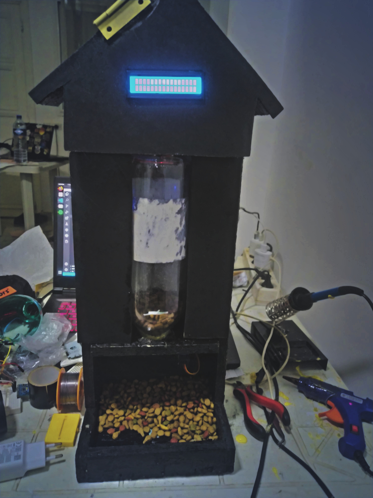

## Description 
"ANIMALA" is an intelligent pet food distributor designed to simplify feeding routines for your beloved pets. With its programmable automatic feedings at designated times, you can have peace of mind knowing your furry friends are well-fed even when you're away.The system also sends timely mobile alerts when the food level is low, ensuring you never miss a refill. Ideal for busy pet owners, "ANIMALA" guarantees proper nutrition and care for your pets, making their well-being a top priority.
## Requirements 
Before running this project, make sure you have the following installed:
- git
- python 3.6+
- CPP compiler
- PlatformIO VS extension
# Clone the repo  
```
git clone https://github.com/hdfixi/Animala.git
```




